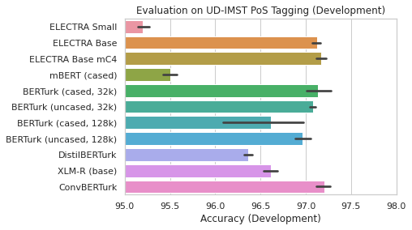
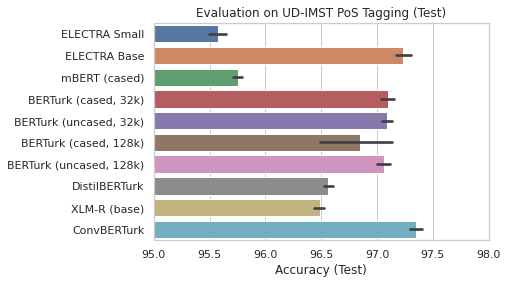
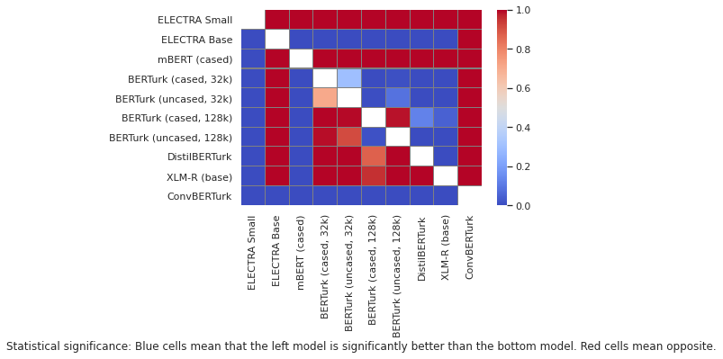
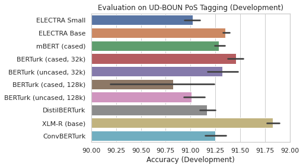
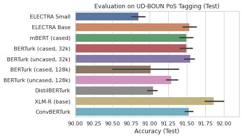
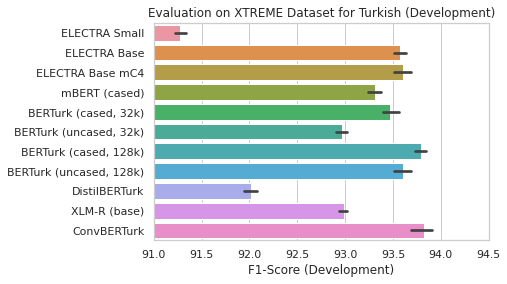
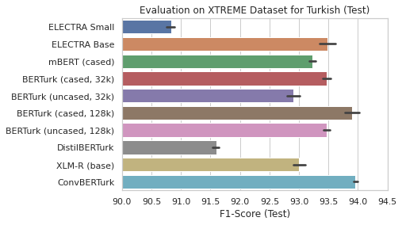
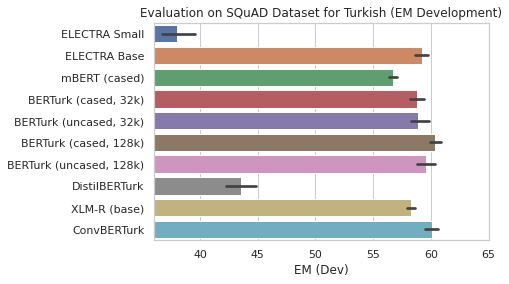
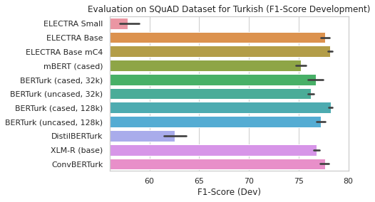

# 🇹🇷 BERTurk

<p align="center">
  
</p>

[](https://zenodo.org/badge/latestdoi/237817454)

We present community-driven BERT, DistilBERT, ELECTRA and ConvBERT models for Turkish 🎉

Some datasets used for pretraining and evaluation are contributed from the
awesome Turkish NLP community, as well as the decision for the BERT model name: BERTurk.

Logo is provided by [Merve Noyan](https://twitter.com/mervenoyann).

# Changelog

* 23.09.2021: Release of uncased ELECTRA and ConvBERT models and cased ELECTRA model, all trained on mC4 corpus.
* 24.06.2021: Release of new ELECTRA model, trained on Turkish part of mC4 dataset. Repository got new awesome logo from Merve Noyan.
* 16.03.2021: Release of *ConvBERTurk* model and more evaluations on different downstream tasks.
* 12.05.2020: Release of ELEC**TR**A ([small](https://huggingface.co/dbmdz/electra-small-turkish-cased-discriminator) 
              and [base](https://huggingface.co/dbmdz/electra-base-turkish-cased-discriminator)) models, see [here](electra/README.md).
* 25.03.2020: Release of *BERTurk* uncased model and *BERTurk* models with larger vocab size (128k, cased and uncased).
* 11.03.2020: Release of the cased distilled *BERTurk* model: *DistilBERTurk*.
              Available on the [Hugging Face model hub](https://huggingface.co/dbmdz/distilbert-base-turkish-cased)
* 17.02.2020: Release of the cased *BERTurk* model.
              Available on the [Hugging Face model hub](https://huggingface.co/dbmdz/bert-base-turkish-cased)
* 10.02.2020: Training corpus update, new TensorBoard links, new results for cased model.
* 02.02.2020: Initial version of this repo.

# Stats

The current version of the model is trained on a filtered and sentence
segmented version of the Turkish [OSCAR corpus](https://traces1.inria.fr/oscar/),
a recent Wikipedia dump, various [OPUS corpora](http://opus.nlpl.eu/) and a
special corpus provided by [Kemal Oflazer](http://www.andrew.cmu.edu/user/ko/).

The final training corpus has a size of 35GB and 4,404,976,662 tokens.

Thanks to Google's TensorFlow Research Cloud (TFRC) we can train both cased and
uncased models on a TPU v3-8. You can find the TensorBoard outputs for
the training here:

* [TensorBoard cased model](https://tensorboard.dev/experiment/ZgFk8LclQOKdW0pYWviLMg/)
* [TensorBoard uncased model](https://tensorboard.dev/experiment/5LlD11cWRwexyqKSEPPXGA/)

We also provide cased and uncased models that aŕe using a larger vocab size (128k instead of 32k).

A detailed cheatsheet of how the models were trained, can be found [here](CHEATSHEET.md).

## C4 Multilingual dataset (mC4)

We've also trained an ELECTRA (cased) model on the recently released Turkish part of the
[multiligual C4 (mC4) corpus](https://github.com/allenai/allennlp/discussions/5265) from the AI2 team.

After filtering documents with a broken encoding, the training corpus has a size of 242GB resulting
in 31,240,963,926 tokens.

We used the original 32k vocab (instead of creating a new one).

# Turkish Model Zoo

Here's an overview of all available models, incl. their training corpus size:

| Model name                 | Model hub link                                                                      | Pre-training corpus size
| -------------------------- | ----------------------------------------------------------------------------------- | ------------------------
| ELECTRA Small (cased)      | [here](https://huggingface.co/dbmdz/electra-small-turkish-cased-discriminator)      | 35GB
| ELECTRA Base (cased)       | [here](https://huggingface.co/dbmdz/electra-base-turkish-cased-discriminator)       | 35GB
| ELECTRA Base mC4 (cased)   | [here](https://huggingface.co/dbmdz/electra-base-turkish-mc4-cased-discriminator)   | 242GB
| ELECTRA Base mC4 (uncased) | [here](https://huggingface.co/dbmdz/electra-base-turkish-mc4-uncased-discriminator) | 242GB
| BERTurk (cased, 32k)       | [here](https://huggingface.co/dbmdz/bert-base-turkish-cased)                        | 35GB
| BERTurk (uncased, 32k)     | [here](https://huggingface.co/dbmdz/bert-base-turkish-uncased)                      | 35GB
| BERTurk (cased, 128k)      | [here](https://huggingface.co/dbmdz/bert-base-turkish-128k-cased)                   | 35GB
| BERTurk (uncased, 128k)    | [here](https://huggingface.co/dbmdz/bert-base-turkish-128k-uncased)                 | 35GB
| DistilBERTurk (cased)      | [here](https://huggingface.co/dbmdz/distilbert-base-turkish-cased)                  | 35GB
| ConvBERTurk (cased)        | [here](https://huggingface.co/dbmdz/convbert-base-turkish-cased)                    | 35GB
| ConvBERTurk mC4 (cased)    | [here](https://huggingface.co/dbmdz/convbert-base-turkish-mc4-cased)                | 242GB
| ConvBERTurk mC4 (uncased)  | [here](https://huggingface.co/dbmdz/convbert-base-turkish-mc4-uncased)              | 242GB

# *DistilBERTurk*

The distilled version of a cased model, so called *DistilBERTurk*, was trained
on 7GB of the original training data, using the cased version of *BERTurk*
as teacher model.

*DistilBERTurk* was trained with the official Hugging Face implementation from
[here](https://github.com/huggingface/transformers/tree/master/examples/distillation).

The cased model was trained for 5 days on 4 RTX 2080 TI.

More details about distillation can be found in the
["DistilBERT, a distilled version of BERT: smaller, faster, cheaper and lighter"](https://arxiv.org/abs/1910.01108)
paper by Sanh et al. (2019).

# ELECTRA

In addition to the *BERTurk* models, we also trained ELEC**TR**A small and base models. A detailed overview can be found
in the [ELECTRA section](electra/README.md).

# ConvBERTurk

In addition to the BERT and ELECTRA based models, we also trained a ConvBERT model. The ConvBERT architecture is presented
in the ["ConvBERT: Improving BERT with Span-based Dynamic Convolution"](https://arxiv.org/abs/2008.02496) paper.

We follow a different training procedure: instead of using a two-phase approach, that pre-trains the model for 90% with 128
sequence length and 10% with 512 sequence length, we pre-train the model with 512 sequence length for 1M steps on a v3-32 TPU.

More details about the pre-training can be found [here](convbert/README.md).

# mC4 ELECTRA

In addition to the ELEC**TR**A base model, we also trained an ELECTRA model on the Turkish part of the mC4 corpus. We use a
sequence length of 512 over the full training time and train the model for 1M steps on a v3-32 TPU.

# Evaluation

For evaluation we use latest Flair 0.8.1 version with a fine-tuning approach for PoS Tagging and NER downstream tasks. In order
to evaluate models on a Turkish question answering dataset, we use the [question answering example](https://github.com/huggingface/transformers/tree/master/examples/question-answering)
from the awesome 🤗 Transformers library.

We use the following hyperparameters for training PoS and NER models with Flair:

| Parameter       | Value
| --------------- | -----
| `batch_size`    | 16
| `learning_rate` | 5e-5
| `num_epochs`    | 10

For the question answering task, we use the same hyperparameters as used in the ["How Good Is Your Tokenizer?"](https://arxiv.org/abs/2012.15613)
paper.

The script `train_flert_model.py` in this repository can be used to fine-tune models on PoS Tagging an NER datasets.

We pre-train models with 5 different seeds and reported averaged accuracy (PoS tagging), F1-score (NER) or EM/F1 (Question answering).

For some downstream tasks, we perform "Almost Stochastic Order" tests as proposed in the
["Deep Dominance - How to Properly Compare Deep Neural Models"](https://www.aclweb.org/anthology/P19-1266/) paper.
The heatmap figures are heavily inspired by the ["CharacterBERT"](https://arxiv.org/abs/2010.10392) paper.

## PoS tagging

We use two different PoS Tagging datasets for Turkish from the Universal Dependencies project:

* [IMST dataset](https://github.com/UniversalDependencies/UD_Turkish-IMST) 
* [BOUN dataset](https://github.com/UniversalDependencies/UD_Turkish-BOUN)

We use the `dev` branch for training/dev/test splits.

### Evaluation on IMST dataset

| Model                      | Development Accuracy | Test Accuracy
| -------------------------- | -------------------- | -------------
| BERTurk (cased, 128k)      | 96.614 ± 0.58        | 96.846 ± 0.42
| BERTurk (cased, 32k)       | 97.138 ± 0.18        | 97.096 ± 0.07
| BERTurk (uncased, 128k)    | 96.964 ± 0.11        | 97.060 ± 0.07
| BERTurk (uncased, 32k)     | 97.080 ± 0.05        | 97.088 ± 0.05
| ConvBERTurk                | 97.208 ± 0.10        | 97.346 ± 0.07
| ConvBERTurk mC4 (cased)    | 97.148 ± 0.07        | 97.426 ± 0.03
| ConvBERTurk mC4 (uncased)  | 97.308 ± 0.09        | 97.338 ± 0.08
| DistilBERTurk              | 96.362 ± 0.05        | 96.560 ± 0.05
| ELECTRA Base               | 97.122 ± 0.06        | 97.232 ± 0.09
| ELECTRA Base mC4 (cased)   | 97.166 ± 0.07        | 97.380 ± 0.05
| ELECTRA Base mC4 (uncased) | 97.058 ± 0.12        | 97.210 ± 0.11
| ELECTRA Small              | 95.196 ± 0.09        | 95.578 ± 0.10
| XLM-R (base)               | 96.618 ± 0.10        | 96.492 ± 0.06
| mBERT (cased)              | 95.504 ± 0.10        | 95.754 ± 0.05





Almost Stochastic Order tests (using the default alpha of 0.05) on test set:



### Evaluation on BOUN dataset

| Model                      | Development Accuracy | Test Accuracy
| -------------------------- | -------------------- | -------------
| BERTurk (cased, 128k)      | 90.828 ± 0.71        | 91.016 ± 0.60
| BERTurk (cased, 32k)       | 91.460 ± 0.10        | 91.490 ± 0.10
| BERTurk (uncased, 128k)    | 91.010 ± 0.15        | 91.286 ± 0.09
| BERTurk (uncased, 32k)     | 91.322 ± 0.19        | 91.544 ± 0.09
| ConvBERTurk                | 91.250 ± 0.14        | 91.524 ± 0.07
| ConvBERTurk mC4 (cased)    | 91.552 ± 0.10        | 91.724 ± 0.07
| ConvBERTurk mC4 (uncased)  | 91.202 ± 0.16        | 91.484 ± 0.12
| DistilBERTurk              | 91.166 ± 0.10        | 91.044 ± 0.09
| ELECTRA Base               | 91.354 ± 0.04        | 91.534 ± 0.11
| ELECTRA Base mC4 (cased)   | 91.402 ± 0.14        | 91.746 ± 0.11
| ELECTRA Base mC4 (uncased) | 91.100 ± 0.13        | 91.178 ± 0.15
| ELECTRA Small              | 91.020 ± 0.11        | 90.850 ± 0.12
| XLM-R (base)               | 91.828 ± 0.08        | 91.862 ± 0.16
| mBERT (cased)              | 91.286 ± 0.07        | 91.492 ± 0.11





## NER

We use the Turkish dataset split from the [XTREME Benchmark](https://arxiv.org/abs/2003.11080).

These training/dev/split were introduced in the ["Massively Multilingual Transfer for NER"](https://arxiv.org/abs/1902.00193)
paper and are based on the famous WikiANN dataset, that is presentend in the
["Cross-lingual Name Tagging and Linking for 282 Languages"](https://www.aclweb.org/anthology/P17-1178/) paper.

| Model                      | Development F1-score | Test F1-score
| -------------------------- | -------------------- | -------------
| BERTurk (cased, 128k)      | 93.796 ± 0.07        | 93.8960 ± 0.16
| BERTurk (cased, 32k)       | 93.470 ± 0.11        | 93.4706 ± 0.09
| BERTurk (uncased, 128k)    | 93.604 ± 0.12        | 93.4686 ± 0.08
| BERTurk (uncased, 32k)     | 92.962 ± 0.08        | 92.9086 ± 0.14
| ConvBERTurk                | 93.822 ± 0.14        | 93.9286 ± 0.07
| ConvBERTurk mC4 (cased)    | 93.778 ± 0.15        | 93.6426 ± 0.15
| ConvBERTurk mC4 (uncased)  | 93.586 ± 0.07        | 93.6206 ± 0.13
| DistilBERTurk              | 92.012 ± 0.09        | 91.5966 ± 0.06
| ELECTRA Base               | 93.572 ± 0.08        | 93.4826 ± 0.17
| ELECTRA Base mC4 (cased)   | 93.600 ± 0.13        | 93.6066 ± 0.12
| ELECTRA Base mC4 (uncased) | 93.092 ± 0.15        | 92.8606 ± 0.36
| ELECTRA Small              | 91.278 ± 0.08        | 90.8306 ± 0.09
| XLM-R (base)               | 92.986 ± 0.05        | 92.9586 ± 0.14
| mBERT (cased)              | 93.308 ± 0.09        | 93.2306 ± 0.07





## Question Answering

We use the Turkish Question Answering dataset from [this website](https://tquad.github.io/turkish-nlp-qa-dataset/)
and report EM and F1-Score on the development set (as reported from Transformers).

| Model                      | Development EM       | Development F1-score
| -------------------------- | -------------------- | -------------
| BERTurk (cased, 128k)      | 60.38 ± 0.61         | 78.21 ± 0.24
| BERTurk (cased, 32k)       | 58.79 ± 0.81         | 76.70 ± 1.04
| BERTurk (uncased, 128k)    | 59.60 ± 1.02         | 77.24 ± 0.59
| BERTurk (uncased, 32k)     | 58.92 ± 1.06         | 76.22 ± 0.42
| ConvBERTurk                | 60.11 ± 0.72         | 77.64 ± 0.59
| ConvBERTurk mC4 (cased)    | 60.65 ± 0.51         | 78.06 ± 0.34
| ConvBERTurk mC4 (uncased)  | 61.28 ± 1.27         | 78.63 ± 0.96
| DistilBERTurk              | 43.52 ± 1.63         | 62.56 ± 1.44
| ELECTRA Base               | 59.24 ± 0.70         | 77.70 ± 0.51
| ELECTRA Base mC4 (cased)   | 61.28 ± 0.94         | 78.17 ± 0.33
| ELECTRA Base mC4 (uncased) | 59.28 ± 0.87         | 76.88 ± 0.61
| ELECTRA Small              | 38.05 ± 1.83         | 57.79 ± 1.22
| XLM-R (base)               | 58.27 ± 0.53         | 76.80 ± 0.39
| mBERT (cased)              | 56.70 ± 0.43         | 75.20 ± 0.61





# Model usage

All trained models can be used from the [DBMDZ](https://github.com/dbmdz) Hugging Face [model hub page](https://huggingface.co/dbmdz)
using their model name. The following models are available:

* *BERTurk* models with 32k vocabulary: `dbmdz/bert-base-turkish-cased` and `dbmdz/bert-base-turkish-uncased`
* *BERTurk* models with 128k vocabulary: `dbmdz/bert-base-turkish-128k-cased` and `dbmdz/bert-base-turkish-128k-uncased`
* *ELECTRA* small and base cased models (discriminator): `dbmdz/electra-small-turkish-cased-discriminator` and `dbmdz/electra-base-turkish-cased-discriminator`
* *ELECTRA* base cased and uncased models, trained on Turkish part of mC4 corpus (discriminator): `dbmdz/electra-small-turkish-mc4-cased-discriminator` and `dbmdz/electra-small-turkish-mc4-uncased-discriminator`
* *ConvBERTurk* model with 32k vocabulary: `dbmdz/convbert-base-turkish-cased`
* *ConvBERTurk* base cased and uncased models, trained on Turkish part of mC4 corpus: `dbmdz/convbert-base-turkish-mc4-cased` and `dbmdz/convbert-base-turkish-mc4-uncased`

Example usage with 🤗/Transformers:

```python
tokenizer = AutoTokenizer.from_pretrained("dbmdz/bert-base-turkish-cased")

model = AutoModel.from_pretrained("dbmdz/bert-base-turkish-cased")
```

This loads the *BERTurk* cased model. The recently introduced ELEC**TR**A base model can be loaded with:

```python
tokenizer = AutoTokenizer.from_pretrained("dbmdz/electra-base-turkish-cased-discriminator")

model = AutoModelWithLMHead.from_pretrained("dbmdz/electra-base-turkish-cased-discriminator")
```

# Citation

You can use the following BibTeX entry for citation:

```bibtex
@software{stefan_schweter_2020_3770924,
  author       = {Stefan Schweter},
  title        = {BERTurk - BERT models for Turkish},
  month        = apr,
  year         = 2020,
  publisher    = {Zenodo},
  version      = {1.0.0},
  doi          = {10.5281/zenodo.3770924},
  url          = {https://doi.org/10.5281/zenodo.3770924}
}
```

# Acknowledgments

Thanks to [Kemal Oflazer](http://www.andrew.cmu.edu/user/ko/) for providing us
additional large corpora for Turkish. Many thanks to Reyyan Yeniterzi for providing
us the Turkish NER dataset for evaluation.

We would like to thank [Merve Noyan](https://twitter.com/mervenoyann) for the
awesome logo!

Research supported with Cloud TPUs from Google's TensorFlow Research Cloud (TFRC).
Thanks for providing access to the TFRC ❤️
