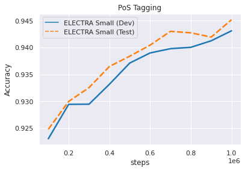
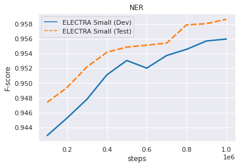
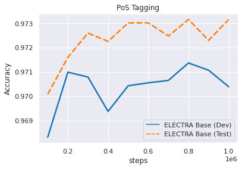
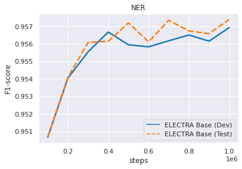
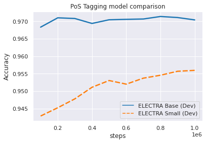
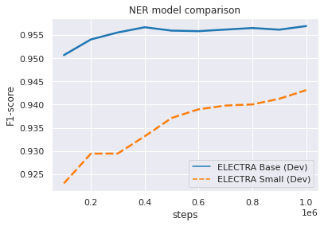
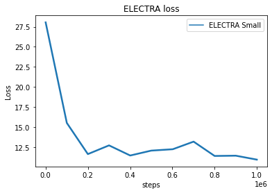
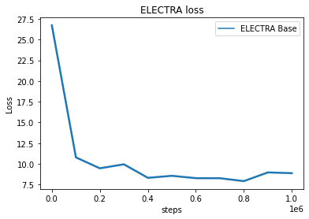

# Turkish ELECTRA models

We release small and base ELEC**TR**A models for Turkish, that were trained on the same data as *BERTurk*.

> ELECTRA is a new method for self-supervised language representation learning. It can be used to
> pre-train transformer networks using relatively little compute. ELECTRA models are trained to
> distinguish "real" input tokens vs "fake" input tokens generated by another neural network, similar to
> the discriminator of a GAN.

More details about ELECTRA can be found in the [ICLR paper](https://openreview.net/forum?id=r1xMH1BtvB)
or in the [official ELECTRA repository](https://github.com/google-research/electra) on GitHub.

# Evaluation

We train both small and base ELECTRA models for 1M steps and do intrinsic and extrinsic evaluations.
Extrinsic evaluations are done for PoS tagging and NER. During pre-training checkpoints were written
every 100k steps. For the final evaluation on downstream taks we evaluate all 10 checkpoints.
We use the same datasets for evaluation as for [*BERTurk*](https://github.com/stefan-it/turkish-bert#evaluation).

Averaged Accuracy (PoS tagging) or averaged F1-Score (NER) over 5 runs for each checkpoint is reported.
That means 50 experiments on each downstream task were performed to select the best and final checkpoint
for the model release.

# ELECTRA small

The ELECTRA small model was trained with the official implementation. The TensorBoard for ELECTRA small
can be found [here](https://tensorboard.dev/experiment/x7RKNiL0SAuPN3rfkg0g1Q).

## PoS Tagging

The following figure shows evaluation on PoS tagging:

Results for the best checkpoint (Development set results in brackets):

| Checkpoint | Run 1             | Run 2             | Run 3             | Run 4             | Run 5             | Avg.
| ---------- | ----------------- | ----------------- | ----------------- | ----------------- | ----------------- | -----------------
| 1M steps   | (0.9567) / 0.9584 | (0.9578) / 0.9589 | (0.9564) / 0.9591 | (0.9544) / 0.9585 | (0.9545) / 0.9582 | (0.9560) / 0.9586

## NER

The following figure shows evaluation on NER dataset:

Results for the best checkpoint (Development set results in brackets):

| Checkpoint | Run 1             | Run 2             | Run 3             | Run 4             | Run 5             | Avg.
| ---------- | ----------------- | ----------------- | ----------------- | ----------------- | ----------------  | -----------------
| 1M steps   | (0.9447) / 0.9468 | (0.9421) / 0.9439 | (0.9421) / 0.9471 | (0.9428) / 0.9434 | (0.9439) / 0.9447 | (0.9431) / 0.9452

# ELECTRA base

The ELECTRA base model was trained with the official implementation. The TensorBoard for that model
can be found [here](https://tensorboard.dev/experiment/YDBnRWY3R1CGWS2wQNKFwQ).

## PoS Tagging

The following figure shows evaluation on PoS tagging:

Results for the best checkpoints (Development set results in brackets):

| Checkpoint | Run 1             | Run 2             | Run 3             | Run 4             | Run 5             | Avg.
| ---------- | ----------------- | ----------------- | ----------------- | ----------------- | ----------------- | -----------------
| 800k steps | (0.9707) / 0.9734 | (0.9710) / 0.9734 | (0.9712) / 0.9745 | (0.9728) / 0.9719 | (0.9711) / 0.9727 | (0.9714) / 0.9732
| 1M steps   | (0.9699) / 0.9727 | (0.9697) / 0.9728 | (0.9715) / 0.9743 | (0.9697) / 0.9724 | (0.9710) / 0.9737 | (0.9704) / 0.9732

## NER

The following figures shows evaluation on NER dataset:

Results for the best checkpoints (Development set results in brackets):

| Checkpoint | Run 1             | Run 2             | Run 3             | Run 4             | Run 5             | Avg.
| ---------- | ----------------- | ----------------- | ----------------- | ----------------- | ----------------- | -----------------
| 800k steps | (0.9564) / 0.9566 | (0.9552) / 0.9557 | (0.9579) / 0.9567 | (0.9563) / 0.9570 | (0.9568) / 0.9577 | (0.9565) / 0.9567
| 1M steps   | (0.9577) / 0.9546 | (0.9553) / 0.9600 | (0.9574) / 0.9570 | (0.9598) / 0.9590 | (0.9545) / 0.9563 | (0.9569) / 0.9574

# Checkpoint selection

For the final ELECTRA small model we use the checkpoint for 1M steps, because this checkpoint achieves the highest scores on development
set for both PoS tagging and NER.

For the final ELECTRA base model we use the checkpoint after 800k steps, because this checkpoint achieves the best scores on average.
The checkpoint after 1M steps performs best for NER, but is the second best checkpoint for PoS tagging. The 800k steps checkpoint performs
best for PoS tagging and is the second best checkpoint for NER. For the final checkpoint selection, we simply compare the best average score
for both tasks, and the checkpoint for 800k is slightly better.

# ELECTRA small vs. base

In this section we present model comparisons for PoS tagging and NER.

The following figure shows difference between ELECTRA small and base for PoS tagging on development set:

The next figure shows a model comparison for NER on development set:

# Model loss

In this section we present the model loss for each checkpoint for small and base ELECTRA models.

Loss curve for each checkpoint step for small model:

And the loss curve for each checkpoint for the base model:

